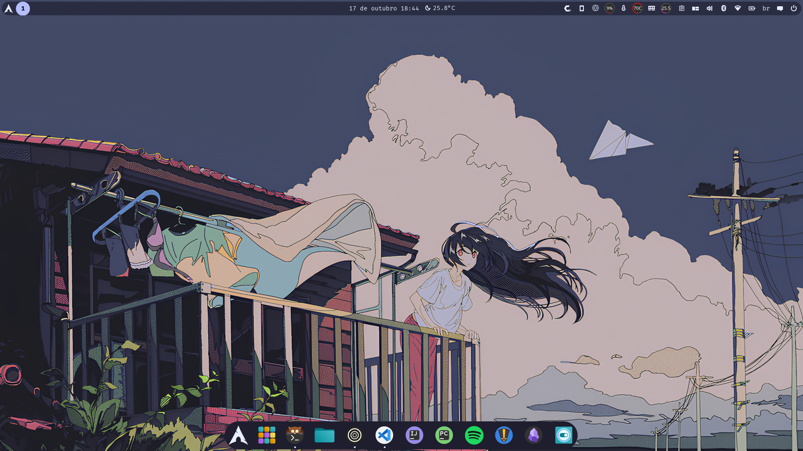
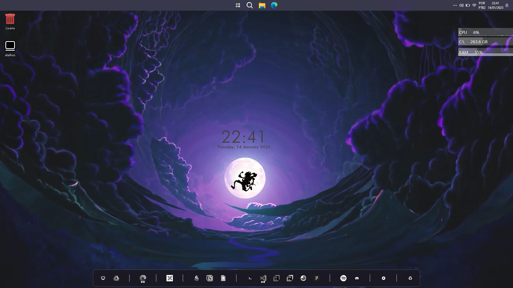
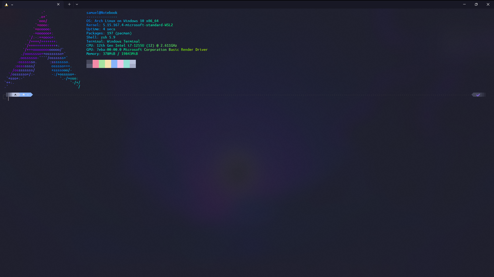
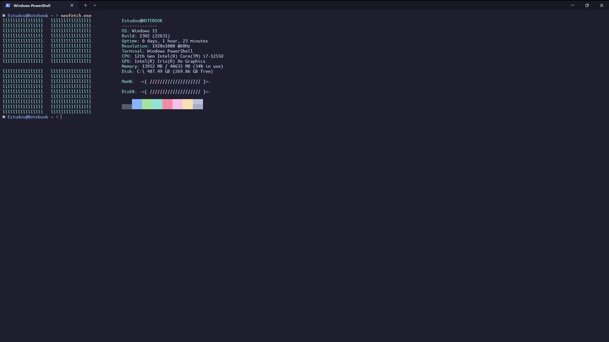

👋 Here are the settings for the programs I use most

<!-- RAINBOW LINE TOP -->

<!-- ABOUT ME -->

# **About:**

- :computer: My Os linux is `Cachyos` / Windosows `11` / Wsl `2`.
- :computer: The terminal I use most is `Kitty` and `Windows Terminal`.
- :technologist: My code editors are `nvim`, `vscode`, `PyCharm` and `IntelliJ`.
- :technologist: In my Linux terminal I use `fish` and in my Windows terminal I use `PowerShell` and `Neofetch` to customize.
- :technologist: Note in all my programs I use the `catppuccin` theme.

<!-- MY SYSTEMS -->

## **Shortcut to Os:**

  
📚 Fotos 

  

    <samp>
      
Linux images

      
      
Windows images

      
      
WSL version

      
    </samp>
  

<!-- MY SKILLS -->

## **Shortcut to Settings:**

  
📚 Fotos 

  

    <samp>
      
<a href="/Kitty/kitty.conf">Kitty Config</a>

      
      
<a href="/Tmux/.tmux.conf">Tmux Config</a>

      
      
<a href="/WindowsTerminal/settings.json">Windows Terminal Config</a>

      
      
<a href="/Neofetch/config.conf">NEOFETCH Config</a>

      
      
<a href="/Nvim/">NVIM Config</a>

      
Linux version

      
      
      
Windows version

      
      
      
Note: For Nvim to stay the same, you need to clone the <a href="https://www.lazyvim.org/installation">Lazzy vim repository</a> and follow all the steps and then clone my settings (If there is an error, contact me)

      
<a href="/VScode/settings.json">VSCode Config</a>

      
      
Pycharm

      
      
IntelliJ

      
      
<a href="/Fish/config.fish">Fish Config</a>

      
      
PowerShell

      
    </samp>
  

<!-- RAINBOW LINE TOP -->

<!-- GIF HEADER -->

[def]: /kitty/kitty.con