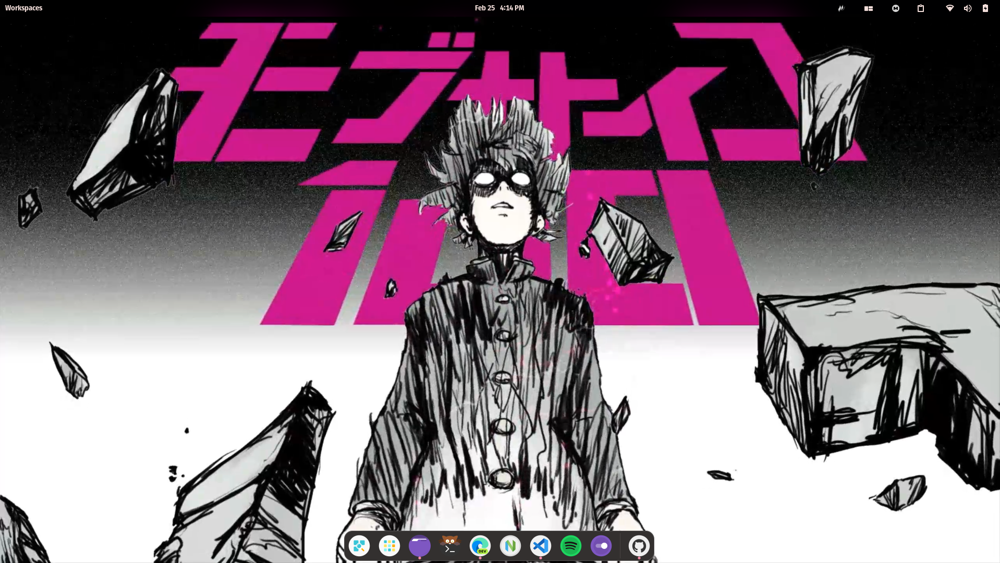
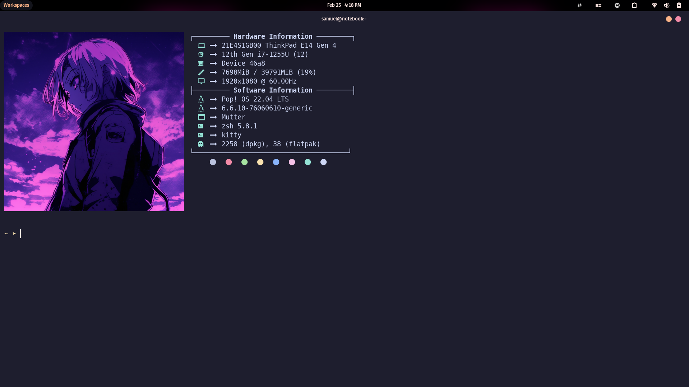
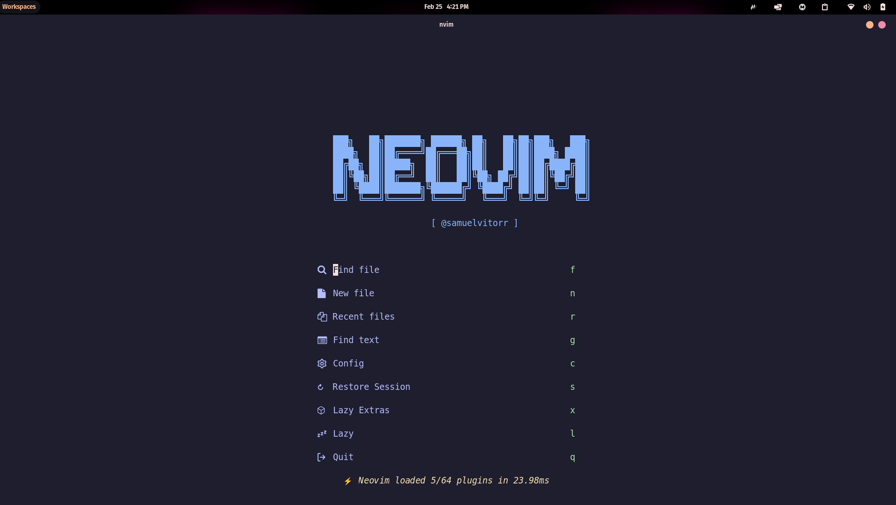
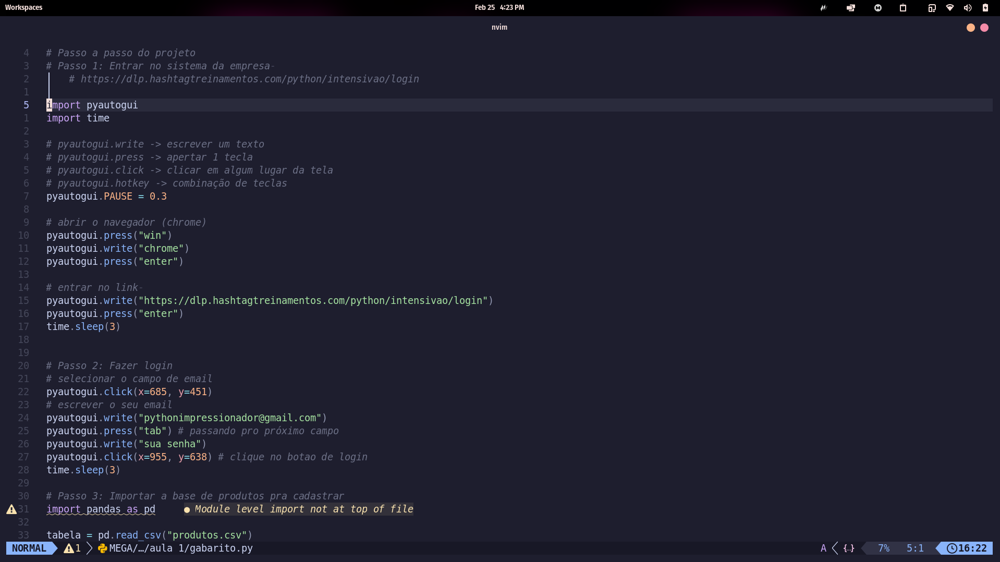
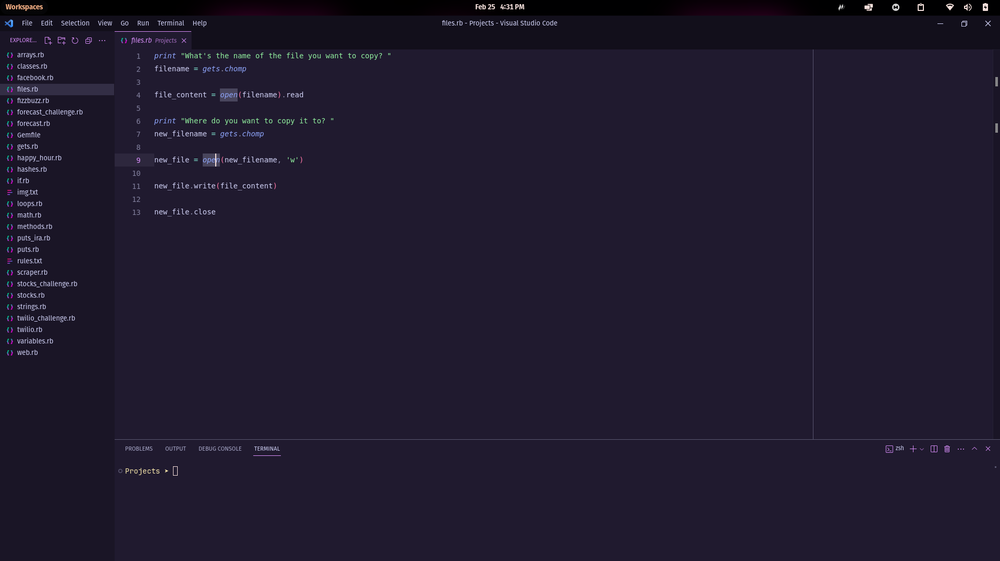

Here are the settings for the programs I use most

<!-- RAINBOW LINE TOP -->

<!-- ABOUT ME -->
## **About:**
- :computer: My distro linux is `Pop OS`.
- :computer: The terminal I use most is `Kitty`.
- :technologist: My code editors are `nvim` and `vscode`.
- :technologist: In my terminal I use the `ZSH` manager and `neofetch` for customization.
- :technologist: note in all my programs I use the `catppuccin` theme.

<!-- RAINBOW LINE TOP -->

<!-- MY SKILLS -->
## **Shortcut to settings:**

  
🧮 summary 

  

    <samp>
      
<a href="./Kitty/kitty.conf">Kitty Config</a>

      
      
<a href="./Neofetch/config.conf">NEOFETCH Config</a>

      
      
<a href="./Nvim/">NVIM Config</a>

      <h2>Note: For Nvim to stay the same, you need to clone the <a href="https://www.lazyvim.org/installation">Lazzy vim repository</a> and follow all the steps and then clone my settings (If there is an error, contact me)</h2>
      

        
        
      

      
<a href="./VScode/settings.json">VSCode Config</a>

      
      
<a href="./ZSH/zshrc">ZSH Config</a>

      
    </samp>
  

<!-- RAINBOW LINE TOP -->

<!-- GIF HEADER -->

