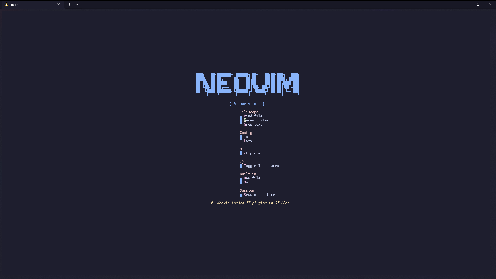
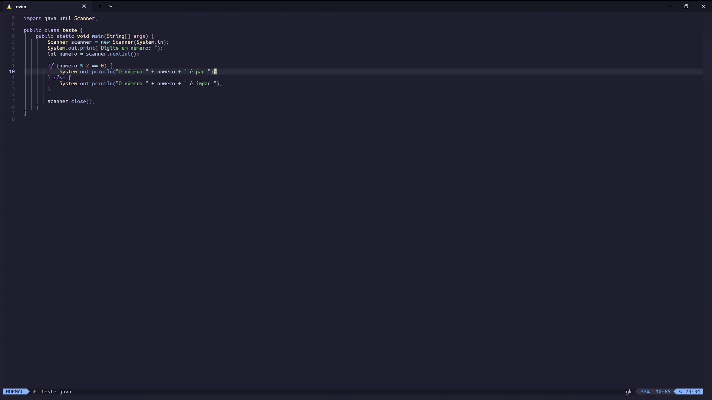

👋 Here are the settings for the programs I use most

<!-- RAINBOW LINE TOP -->

<!-- ABOUT ME -->
## **About:**
- :computer: My Os linux is `Pop OS` / Windosows `11` /  Wsl `2`.
- :computer: The terminal I use most is `Kitty` and `Windows Terminal`.
- :technologist: My code editors are `nvim`, `vscode`, `PyCharm` and `IntelliJ`.
- :technologist: In my Linux terminal I use ZSH and in my Windows terminal I use PowerShell and Neofetch to customize.
- :technologist: note in all my programs I use the `catppuccin` theme.

<!-- MY SYSTEMS -->
## **Shortcut to Os:**

  
🧮 Fotos 

  

    <samp>
      
Linux images

      
      
Windows images

      
      
WSL version

      
    </samp>
  

<!-- MY SKILLS -->
## **Shortcut to settings:**

  
🧮 Fotos 

  

    <samp>
      
<a href="./Kitty/kitty.conf">Kitty Config</a>

      
      
<a href="./windowsTerminal/settings.json">Windows Terminal Config</a>

      
      
<a href="./Neofetch/config.conf">NEOFETCH Config</a>

      
      
<a href="./Nvim/">NVIM Config</a>

      
Linux version

      
      
      
Windows version

      
      
      
Note: For Nvim to stay the same, you need to clone the <a href="https://www.lazyvim.org/installation">Lazzy vim repository</a> and follow all the steps and then clone my settings (If there is an error, contact me)

      
<a href="./VScode/settings.json">VSCode Config</a>

      
      
Pycharm

      
      
IntelliJ

      
      
<a href="./ZSH/zshrc">ZSH Config</a>

      
      
<a href="./Zsh/.zshrc">PowerShell Config</a>

      
    </samp>
  

<!-- RAINBOW LINE TOP -->

<!-- GIF HEADER -->

